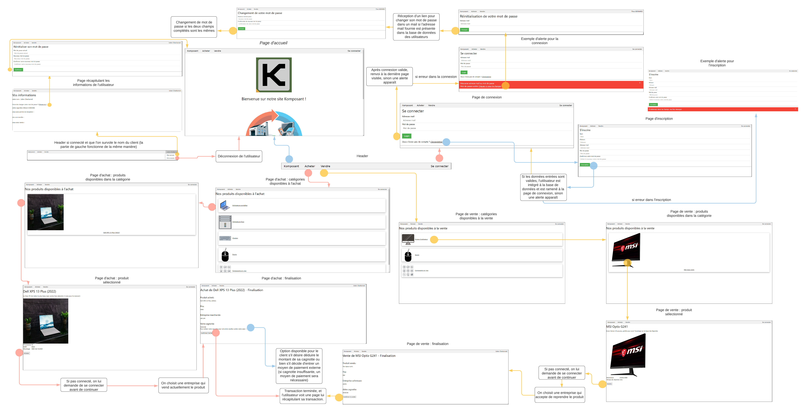

# Rapport: développement d'un site web pour une entreprise d'économie circulaire

# Plan

- Introduction
- Organisation
- Wireflow
- Cas d'utilisations
- Conclusions personnelles

# Introduction

Le but de la SAÉ est de créer un site web permettant à un utilisateur d'acheter du matériel informatique et d'en revendre à des entreprises spécialisées dans le recyclage. 

L'utilisateur doit pouvoir voir sa cagnotte, ainsi que les matériaux qu'il a permis de recycler. Il peut aussi parcourir le site pour acheter et revendre du matériel.

# Organisation

##  Repartitions des tâches

### Trello

Pour se répartir les tâches nous avons décidé d'utiliser [Trello](https://trello.com/b/i1b6ghEQ/site).

Ce magnifique outil nous permet de planifier les tâches et de les assigner à un membre du groupe. On peut voir l'avancée globale du projet mais aussi de chacune des parties du projet.

## Fonctionnement du repo git

### Choix de la plateforme

Gitlab a été notre choix principal pour nous permettre d'automatiser des tâches pour que chacun d'entre nous puisse travailler et ne pas avoir à attendre la personne chez qui le projet est hébergé.

### Déploiement automatique

Pour le déploiement nous avons décidé d'utiliser Gitlab, plus précisement la partie CI/CD qui nous permet de développer le site et d'envoyer les changements automatiquement sur le serveur dwarves à chaque push (principalement les pushs faits sur la branche `master`).

À chaque push, gitlab va exécuter ce que l'on appele des pipelines. Les pipelines permettent de faire des actions précisées dans un fichier appelé `gitlab-ci.yml` (pour gitlab). On peut choisir d'exécuter des tests, de déployer un site ou bien une application.

Dans notre cas, nous avons une pipeline qui vient compresser le dossier `src/` qui contient les fichiers sources du site. Puis une autre qui va envoyer ce fichier zip sur iluvatar et le décompresser ensuite dans notre dossier `public_html`.

On pourrait mettre en place des tests qui seront exécutés dans le premier pipeline pour vérifier que les fichiers .php ont une syntaxe valide et qu'ils contiennent bien des valeurs que l'on doit pouvoir retrouver pendant le fonctionnement normal du site.

### Branches autres que master

Lorsque l'on push sur une branche différente de master, le script vient changer le nom du dossier dans lequel sera mis le site comme ceci: `k_$COMMIT_BRANCH_NAME` -> `k_yvan`.
Cela permet de tester en cas de grand changements et que l'on puisse approuver le travail de chaque personne du groupe.

# Wireflow

Le wireflow peut se retrouver en plus grand format sur le lien [wireflow.png](./wireflow.png)

# Cas d'utilisations

## Mot de passe oublié

Nous avons pu rajouté une magnifique fonctionnalité pour pouvoir changer son mot de passe en cas d'oublie. 

Lorsqu'un mot de passe mauvais est entré, le site porpose à l'utilisateur de changer son mot de passe et l'emmène sur un formulaire de mot de passe oublié.
L'utilisateur peut choisir d'entrer son addresse mail et pourra ensuite recevoir un mail avec un lien de réinitiliasation de mot de passe.

L'adresse [iut.yvan.dev/komposant](https://iut.yvan.dev) est valide et a été mise en place juste pour que le mail puisse s'envoyer. En cas de problèmes, le lien est quand même affiché en clair (en entreprise, nous n'aurions pas fait cela, c'est juste du secours).

# Conclusions personnelles

## Mathis

J’ai commencé par avoir du mal à travailler sur le projet étant donné que je n’aime pas spécialement le développement web et que le sujet était difficile à comprendre parfaitement et clairement. Mais le fait que le gros du travail devait être concentré sur la partie backend a été l’un des éléments atténuants qui ont fait que j’ai quand même fini par apprécier travailler sur ce projet. L’ambiance dans le groupe de projet ainsi que les différentes solutions mises en place par mes camarades pour faciliter le travail ont également eu un gros impact positif sur mon expérience du projet.
J’ai finalement pris goût au projet et ai apprécié faire ce sur quoi j’ai travaillé. Le projet m’a permis de me familiariser avec le php et d’approfondir mes connaissances dans ce langage, en particulier grâce à mes camarades.

## Théo

Personnellement, j'ai apprécié ce projet puisque je préfère le travail en équipe à un travail individuel : être à plusieurs permet de partager son savoir avec ses camarades, d'avoir différents points de vue et différentes approches d'un même élément, et c'est quelque chose que j'affectionne. Je trouve que ce projet était une bonne représentation de ce à quoi vont ressembler nos projets en entreprise, il constitue donc un bon entraînement et une belle préparation à ce fameux monde du travail.

## Yvan

Pour moi le projet fut intéréssant, l'aspect (re)découverte du travail en groupe m'a permis de mieux maîtriser git qu'avant. J'ai pu aussi avoir beaucoup de plaisir à paramètrer le déploiement automatique du site grâce à la CI/CD de gitlab. Cela fut un défi technique intéréssant à relever.
